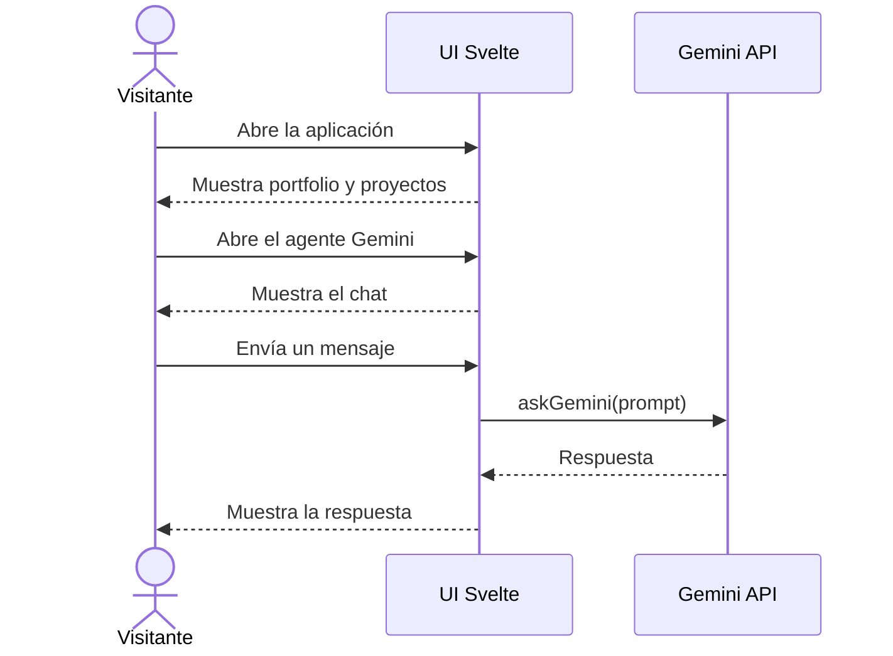

# UML — Diagrama de Secuencia (Acceso público y agente)

```mermaid
sequenceDiagram
  actor Visitante
  participant UI as UI Svelte
  participant Gemini as Gemini API

  Visitante->>UI: Abre la aplicación
  UI-->>Visitante: Muestra portfolio y proyectos
  Visitante->>UI: Abre el agente Gemini
  UI-->>Visitante: Muestra el chat
  Visitante->>UI: Envía un mensaje
  UI->>Gemini: askGemini(prompt)
  Gemini-->>UI: Respuesta
  UI-->>Visitante: Muestra la respuesta
```
